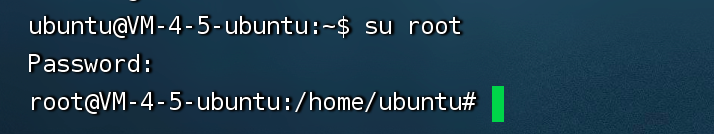
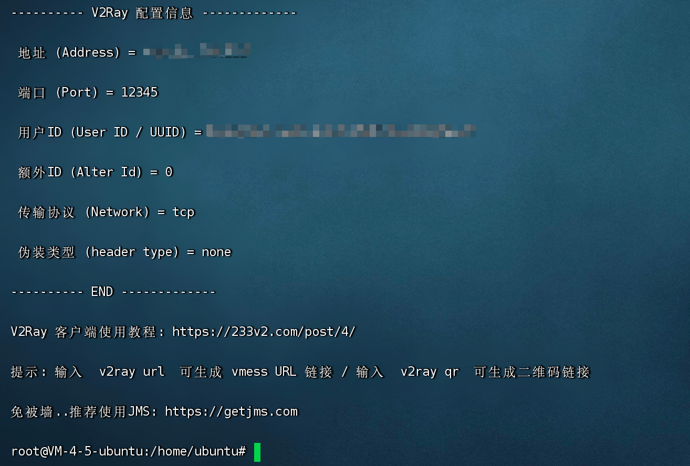
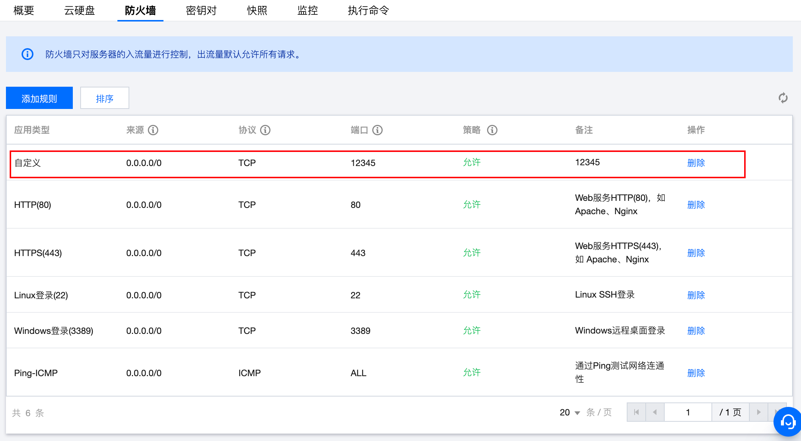
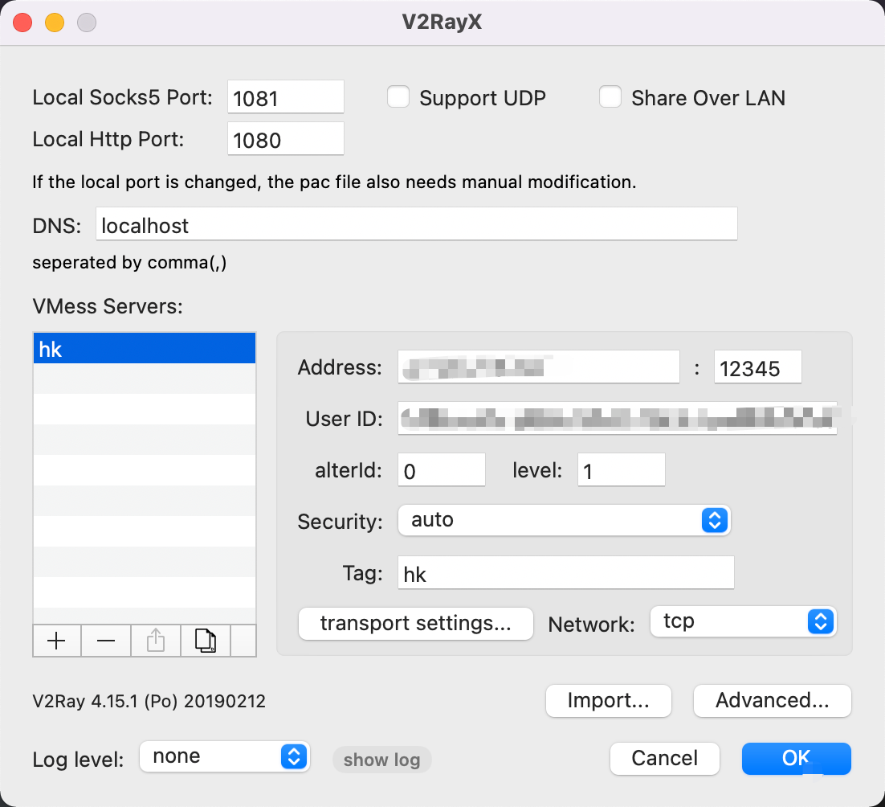

V2rayX

一、服务器配置

1. 购买服务器（腾讯云 轻量应用服务器）

2. 安装镜像 Ubuntu

3. 重置root和ubuntu密码

4. SSL登录

   

   主机连接成功后

   `su root`

   `root password`

   

5. `bash <(curl -L https://raw.githubusercontent.com/v2fly/fhs-install-v2ray/master/install-release.sh)`

   一直回车即可

6. 得到v2ray配置信息

   

7. 打开服务器防火墙

二、mac 配置

1. 安装v2rayx

   `brew install --cask v2rayx`

2. 配置v2rayx

   

3. 开启v2rayx，试试吧

三、可能遇到的问题

1. 开启后，网络不通：

   是防火墙的问题，添加防火墙规则即可。
